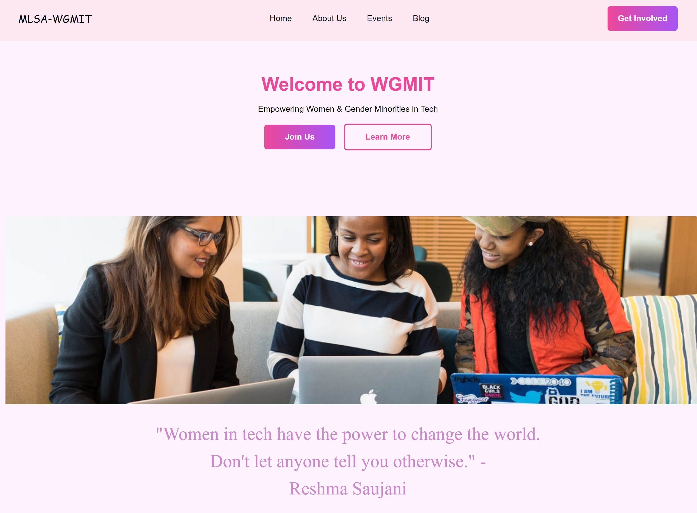

# BOM-portfolio

## Description
Welcome to my portfolio! Here you'll find a showcase of my myself, skills, experiences in the field of software development and a way to contact me. Butilt on GitHub, this repository contains all you need to build a user-friendly and dynamic portfolio.
[Portfolio Link](https://bom-portfolio.netlify.app/) and
[GitHub Repository](https://github.com/Olorunshogo)

## Table Of Content
1. Title
2. Description
3. Key Features
4. Sections
    + Home Section
    + About Me
      - Education
      - Experience
      - Languages: JavaScript
      - Frontend: HTML, CSS
      - Other: Git
    + Services
      - UI/UX
      - Web Development
      - Web Design
    + Porfolio
      - BOM Portfolio
      - Holorunshogo Italian Recipes
      - Netflix Homepage
      - WGMIT Website
    + Contact
5. Usage Guide 
6. Contribution
7. License

## Features
  + Responsive Design: Mobile and Tablet-friendly interface ensuring a consistent and enjoyable experience across devices.
  + Project Showcase
  + Services Showcase
  + Contact Showcase

## Sections
### Home Section
Meet me, the author.

### About Me

I'm a passionate software developer with a keen interest in building impactful solutions. I'm passionate about creating engaging and user-friendly websites that leave a lasting impression. 
I have a solid foundation in mechanical engineering and enjoy exploring new technologies to solve complex problems. I bring a unique perspective to every project I work on.

#### Education
+ Bachelor of Science in Computer Science
  - Federal University of Technology (FUT), Minna, Niger State, Nigeria, Graduated 2023

#### Experience
+ Frontend Web Developer at Workmate Technologies (April, 2024)

### Services

#### 1. UI/UX

User experience is at the forefront of everything I do. I strive to create intuitive interfaces that make navigating your website a breeze for users.

### 2. Web Development

I'm proficient in front-end web development, utilizing the latest technologies to build responsive and scalable websites.

### 3. Web Design

I specialize in creating visually stunning designs that are both modern and functional. From concept to completion, I'll work closely with you to bring your vision to life.

## Portfolio
A few of my recent projects is showcased in this section including this portfolio.

### Project 1: [BOM Portfolio](https://bom-portfolio.netlify.app/)
Description: Here you'll find a showcase of my myself, skills, experiences in the field of software development and a way to contact me. Feel free to contribute [GitHub Repository](https://github.com/Olorunshogo/BOM-portfolio).

### Project 2: [Holorunshogo Italian Recipes](https://holorunshogo-italian-recipes.netlify.app/)

Description: Here is the homepage, dashboard, log in and sign up web pages of an italian recipe website that allows its users to create, edit, and save favorite recipes. Users can also upload recipes to the community of italian cuisine lovers and enthusiast. Feel free to contribute [GitHub Repository](https://github.com/Olorunshogo/italian-recipes).

### Project 3: [Netflix Homepage](https://netfleek.netlify.app)

Description: This is me just recreating Netflix's homepage to the best of my ability. Feel free to contribute [GitHub Repository](https://github.com/Olorunshogo/netflix).

### Project 4: [WMGIT](https://mlsa-wgmit.github.io/WGMIT-Website/)

Description: This is me just recrating Netflix's homepage to the best of my ability. Feel free to contribute as you deem fit. [GitHub Repository](https://github.com/Olorunshogo/netflix).

### Contact

Have a project in mind? Feel free to reach out to me using the contact form below or, feel free to connect with me on [LinkedIn](https://www.linkedin.com/in/olorunshogo-bamtefa-0839601b4/).

[Contact Form](mailto:shownzy001@gmail.com)

## Usage Guide
Usage guide for BOM Portfolio
1. Home Section:
    + Begin by reading the Home section for a brief introduction of the portfolio.
    + This section provides an overview of the portfolio's purpose and content.

2. About Section:
    + Navigate to the About Section to learn more about the author of the portfolio (me).
    + Discover my skills, experiences, educational background and contact information.

3. Services Section
    + Explore the Services section to understand the range of services offered by the author.
    + This section may include services such as UI/UX design, web development and web design.

4. Portfolio Section
    + Showcase past projects developed by me.
    + Organize projects in order of how recen they are.
 
5. Contact Section
    + Provide multiple ways to contact me which include email, contact form, phone number and contact form

## Contribution
Have a great idea for a new feature? I'd love to hear it! Open an issue and describe your feature request in detail. Your input helps shape the future of this project.

## License 
MIT License

